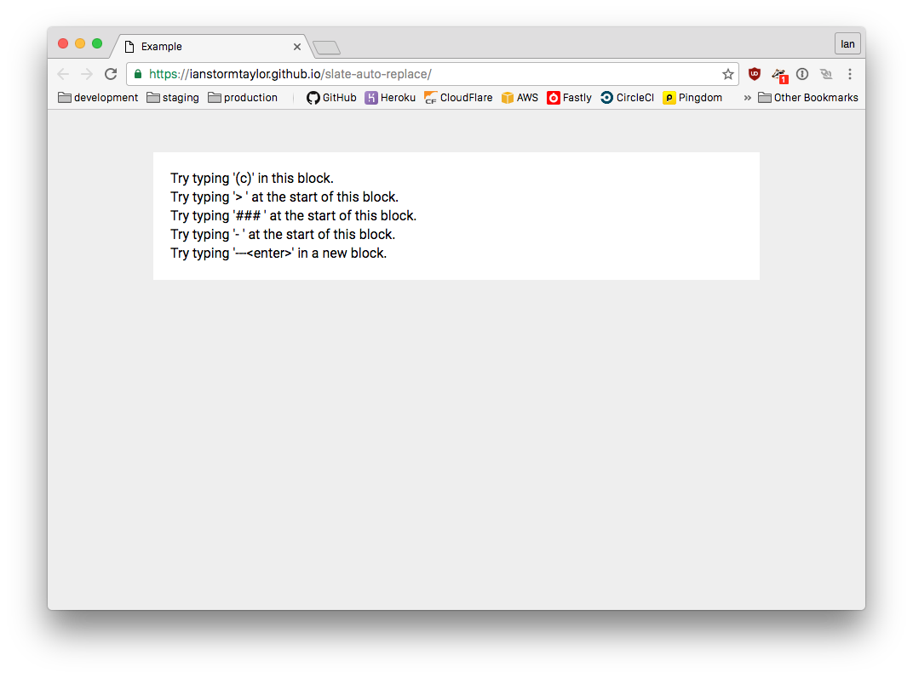

<h3 align="center"><code>slate-auto-replace</code></h3>

A [**Slate**](https://github.com/ianstormtaylor/slate) plugin to automatically replace text and apply transforms when the user types certain strings. Useful for implementing "auto-markdown" or other hotkey-based replacement behaviors.

[](
https://ianstormtaylor.github.io/slate-auto-replace/)

---

### Install

```
npm install --save slate-auto-replace
```

_You will need to have installed `slate` as a dependency already._

---

### Usage

```js
import AutoReplace from 'slate-auto-replace'
import { Editor } from 'slate'

// Add the plugin to your set of plugins...
const plugins = [
  AutoReplace({
    trigger: 'space',
    before: /^(>)$/,
    transform: (transform, e, data, matches) => {
      return transform.setBlock({ type: 'quote' })
    }
  })
]

// And later pass it into the Slate editor...
<Editor
  ...
  plugins={plugins}
/>
```

Option | Type | Description
--- | --- | ---
**`trigger`** | `String` `RegExp` | The trigger to match the inputed character against—either a character like `a` or a key name like `enter` or `tab`.
**`transform`** | `Function` | A function to apply the desired transform. It will be passed a Slate `Transform` object and the `data` object from the matching event handler.
**`after`** | `RegExp` | An optional regexp that must match the text after the trigger for the replacement to occur. Any capturing groups in the regexp will be deleted from the text content.
**`before`** | `RegExp` | An optional regexp that must match the text before the trigger for the replacement to occur. Any capturing groups in the regexp will be deleted from the text content.
**`ignoreIn`** | `Function` `Array` `String` | An optional block matcher to ignore triggers inside. If passed an array or string it will match by `node.type`.
**`onlyIn`** | `Function` `Array` `String` | An optional block matcher to only replace triggers inside. If passed an array or string it will match by `node.type`.

---

### Development

Clone the repository and then run:

```
npm install
npm run watch
```

And open the example page in your browser:

```
http://localhost:8888/
```

---

### License

Copyright &copy; 2016, [Ian Storm Taylor](https://ianstormtaylor.com)

Permission is hereby granted, free of charge, to any person obtaining a copy of this software and associated documentation files (the "Software"), to deal in the Software without restriction, including without limitation the rights to use, copy, modify, merge, publish, distribute, sublicense, and/or sell copies of the Software, and to permit persons to whom the Software is furnished to do so, subject to the following conditions:

The above copyright notice and this permission notice shall be included in all copies or substantial portions of the Software.

THE SOFTWARE IS PROVIDED "AS IS", WITHOUT WARRANTY OF ANY KIND, EXPRESS OR IMPLIED, INCLUDING BUT NOT LIMITED TO THE WARRANTIES OF MERCHANTABILITY, FITNESS FOR A PARTICULAR PURPOSE AND NONINFRINGEMENT. IN NO EVENT SHALL THE AUTHORS OR COPYRIGHT HOLDERS BE LIABLE FOR ANY CLAIM, DAMAGES OR OTHER LIABILITY, WHETHER IN AN ACTION OF CONTRACT, TORT OR OTHERWISE, ARISING FROM, OUT OF OR IN CONNECTION WITH THE SOFTWARE OR THE USE OR OTHER DEALINGS IN THE SOFTWARE.
